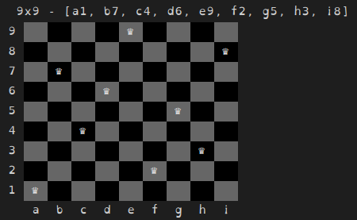

== N-Queens Solver

This program provides an experimentation platform to test different
solutions to solving the N-Queens problem (with the specific constraints
described below).

=== Problem Statement

Place N queens on an NxN chess board so that none of them attack each
other (the classic n-queens problem). Additionally, please make sure that
no three queens are in a straight line at ANY angle, so queens on A1, C2
and E3, despite not attacking each other, form a straight line at some
angle.

=== Building the Uber-Jar

This project can produce an executable JAR file that includes all the
necessary dependencies, as well as (currently broken #6) start scripts
and packaged bundles by running the following command:

[source, bash]
----
./gradlew shadowJar
----

=== Running the Solver

This project includes a CLI program which outputs solutions to the puzzle
via the console.  This program can be run with any of the three following
commands (after building the project):

[source, bash]
----
./gradlew --warning-mode none run
./gradlew --warning-mode none runShadow
java -jar app/build/libs/app-all.jar
----

Output is displayed for each puzzle size from 1 to 18.  The image below
provides an example of the display for the 9x9 puzzle.

Note that running the program using Gradle has the unfortunate side-effect
of filtering out ANSI control characters.

=== Design Considerations

The idea of a chessboard, square and piece are generalized as this package
might be used for other games or puzzles (e.g. actually playing chess).
For the N-Queens puzzle, a custom board which can indicate when constraints
are violated is provided.

Likewise, the `Solver` interface provides an abstraction to one or more
solvers.  Ultimately this will allow CLI flags to choose and configure
solvers as they are added to the project.  The concept of violations and
rules are also provided for use by multiple solvers.

=== Development

Developers using Eclipse or VS Code should run the following task to
make sure their project and classpath configuration are correct:

[source, shell]
----
./gradlew eclipse
----

Issues for this project are tracked using https://github.com/smoyer64/nqueens/issues[Github issues]
and this project will happily accept https://github.com/smoyer64/nqueens/pulls[pull-requests] fixing bugs, adding
features and enhancing the program.
